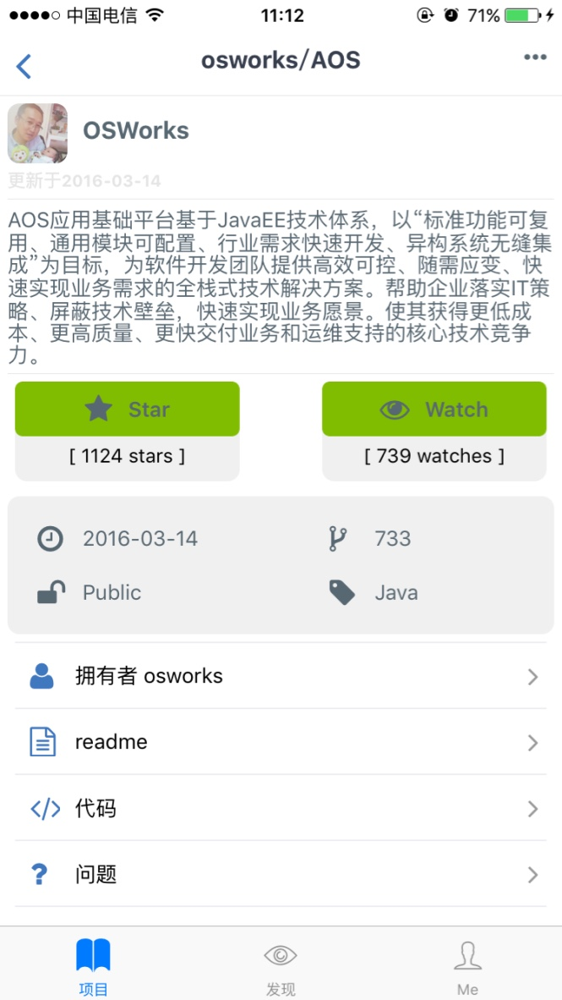

# ReactNative Git@OSC

[](https://github.com/feross/standard)

An App of Git@OSC by React-Native (Thanks for [xiekw2010](https://github.com/xiekw2010/react-native-gitfeed))





**[More screenshots](./screen)**
## Getting Started

## An App of Git@OSC by React-native

### Features

1. Recommend/Trending/Recent Update Project view.
2. Discover project view.
3. User profile(Update/Project/Star/Watch).
3. My profile/Settings/Shake/Comments/Share.
4. Project details/Star/Watch/ Code/README/issues and submit an issue

## How to build this

###Install JS env

`npm install`

if error about 'EACCS' try

`sudo chown -R $(whoami) "$HOME/.npm"`

##iOS

open the project in ios dir `cd ios`

`pod install`

### Release mode

1. edit xcode project `OSCGit`'s scheme to `release` mode


2. bundle the JS resources, in project root dir (如果第一次运行没生存index.ios.jsbundle,再运行一次)

  ```sh
 react-native bundle --entry-file index.ios.js --bundle-output ./ios/bundle/index.ios.jsbundle --platform ios --assets-dest ./ios/bundle --dev false --sourcemap-output ./ios/bundle/source.map --verbose
  ```
3. xcode run!

### Debug mode

Edit xcode project `OSCGit` edit scheme to `debug` mode

Xcode run!

## Android
    - 还未测试.(下一步准备让android也运行起来,然后再总结.)

## code-push hot reloader (optional)
### Installation
    ```bash
    cnpm install -g code-push-cli --verbose
    code-push register (follow instruction in the popup window)
    ode-push access-key ls
    
    code-push app add RN_OSCGit
    
    code-push deployment ls RN_OSCGit
    
    code-push release-react RN_OSCGit ios --entryFile ./ios/bundle/index.ios.jsbundle
    
    #release RN_OSCGit ./ios/bundle 1.0.7 -d Production
    ```

### Check app status

	code-push deployment ls RN_OSCGit

### Publish update

	#release RN_OSCGit ./ios/bundle 1.0.7 -d Production
	code-push release-react RN_OSCGit ios --entryFile ./ios/bundle/index.ios.jsbundle

## Let's talk about it (So far only Chinese supported)  

### License
[GPL](./LICENSE.txt). Copyright (c) [netray722](https://github.com/netray722).